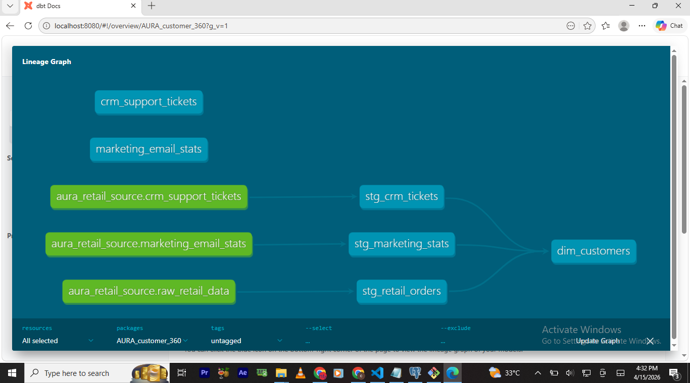
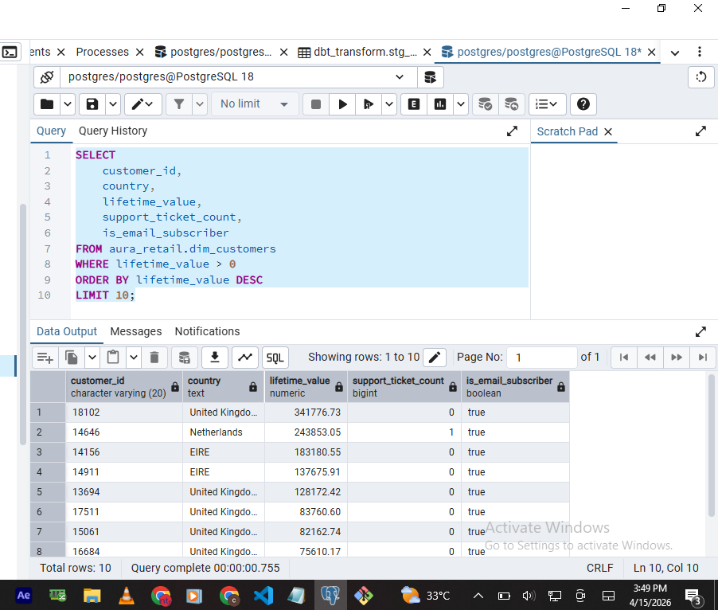

# The AURA Revenue Intelligence: Customer 360 Pipeline

## 📌 Project Overview
AURA Revenue Intelligence is a data engineering project that unifies fragmented business silos into a single, actionable "Customer 360" view. This pipeline integrates retail transactions, CRM support logs, and marketing engagement data to provide a holistic view of customer health and lifetime value.

## 📊 Data Lineage (The "How")
The project follows a modular Medallion architecture (Staging -> Marts) to transform raw data into a deduplicated Analytical Mart.

 

## 🛠️ Tech Stack
* **Database:** PostgreSQL
* **Transformation:** dbt (data build tool)
* **Ingestion:** Python (Pandas/SQLAlchemy) for bulk retail data & dbt Seeds for CRM/Marketing.
* **Orchestration:** Git/GitHub for version control.

## 💡 Key Engineering Challenges Solved
* **Data Fan-out Resolution:** Fixed SQL join duplicates caused by customers having multiple country records in source data using `GROUP BY` and `MAX()` windowing logic.
* **Schema Integrity:** Resolved `VARCHAR` vs `INTEGER` type mismatches during cross-silo joins using explicit casting.
* **Quality Assurance:** Implemented automated dbt tests (`unique`, `not_null`) to ensure the reliability of the final Customer ID dimension.

## 💎 Business Insights: Identifying "Star VIPs"
Using the final `dim_customers` mart, we can immediately identify our most valuable, friction-free customers. These are high-spenders with zero support tickets who are subscribed to our marketing updates.

**Querying Top 10 VIP Customers:**

## 📂 Repository Structure
* `/AURA_customer_360`: The core dbt workspace containing models, tests, and configurations.
* `bulk_load_retail.py`: Python script for high-performance ingestion of 500k+ retail records.

## ✉️ Contact & Connect
If you have any questions about this project or want to chat about Data Engineering, feel free to reach out!

 **Favour Peter James** 
* **Portfolio** [https://peterjames2019.github.io/]
* **LinkedIn:** [https://linkedin.com/in/favour-peter-43b330263]
* **GitHub:** [https://github.com/peterjames2019]